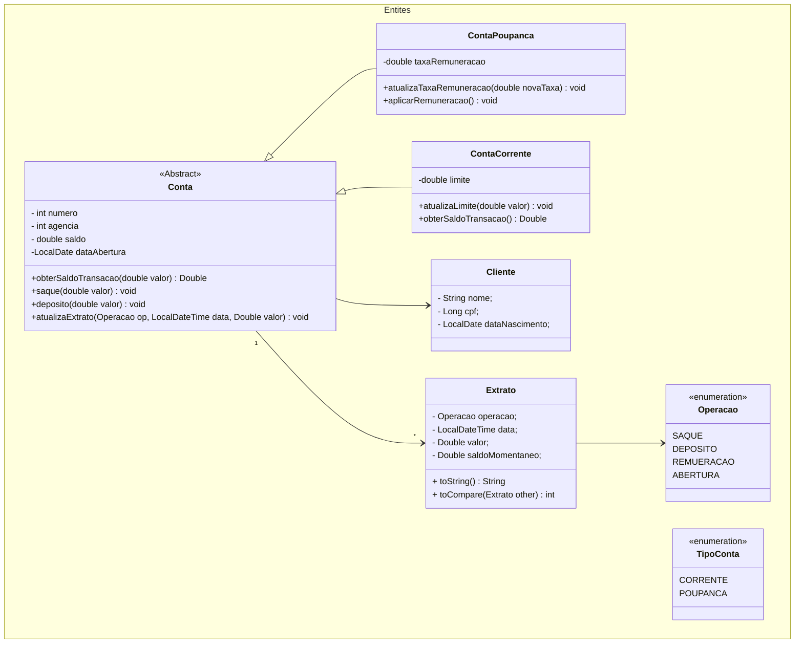

# Aplicação de Banco :bank:
- Aplicação bancária destinada ao usuário funcionário do banco. 
- Inicialmente possui uma interface básica em CLI.

# :hammer: Funcionalidades do projeto

- `1`. `Abertura de Contas`: Deverá informar os dados do cliente e escolher entre conta corrente ou conta poupança =).
- `2`. `Depósito`: Caso o cliente tenha dinheiro sobrando, pode deixar na conta e se for poupança ainda irá render uns trocados.
- `3`. `Saque`: Obviamente precisa ter saldo para efetuar saques. Caso a conta seja corrente, é considerado o saldo da conta + o limite da mesma.
- `4`. `Alterar Limite`: Altera o limite da conta. Somente para conta corrente.
- `5`. `Transferêcia`: Efetua transferencias entre contas. Basicamente essa operação executa a funcionalidade de saque na conta de origem e a operação de depósito na conta de destino. Possui limitação de horário. 
- `6`. `Exportação de histórico de transações (CSV)`: Gera arquivo CSV com o histórico de todas as transações (Extrato da Conta). O arquivo é gerado no diretório raiz do projeto. São salvos 4 tipos de oepração no histórico:
  * ABERTURA
  * SAQUE
  * DEPOSITO
  * REMUNERAÇÃO
- `7`. `Imprimir extrato da conta na tela`: Imprimi os mesmo dados de histórico de transações na tela. 
- `8`. `Imprimir todos Depósitos.`: Imprime na tela o histórico de todos os depósitos efetuados.
- `9`. `Imprimir todos os saques`: Imprime na tela o histórico de todas as retiradas efetuadas.
- `10`. `Aplicar taxa de remuneração.`: Aplica taxa de remuneração cadastrada na conta e aplica a porcentagem de juros no saldo atual da conta. Somente para conta poupança.
  

## :wrench: Como executar o projeto

- Você pode [acessar o código fonte do projeto ](https://github.com/flavioqueiroga/desafio-app-banco/tree/main) ou [baixá-lo](https://github.com/flavioqueiroga/desafio-app-banco/archive/refs/heads/main.zip)
- Após efetuar o download do projeto, basta executar a classe principal "App" no pacote "application", que a aplicação irá abrir o MENU inicial no console ou em sua IDE de preferencia.

## Utilizando a aplicação
1. Assim que iniciar a execução da aplicação como mostrado no ....
2. Aparecerá um MENU incial com todas as funcionalidades, cada uma com um respectivo número. Informe o nº da opção para prosseguir.
3. De acordo com a opção será solicitada a entrada de informações para executar as operações.
- *Veja exemplo abaixo*:

   

## Diagrama de classes

### Diagrama de Entidades

