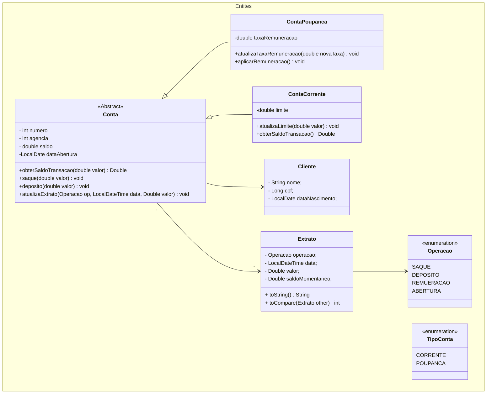

# Aplicação de Banco

- Aplicação bancária destinada ao usuário funcionário do banco.
- Inicialmente possui uma interface básica em CLI.

# :hammer: Funcionalidades do projeto

- `1`. `Abertura de Contas`: Deverá informar os dados do cliente e escolher entre conta corrente ou conta poupança =).
- `2`. `Depósito`: Caso o cliente tenha dinheiro sobrando, pode deixar na conta e se for poupança ainda irá render uns trocados.
- `3`. `Saque`: Obviamente precisa ter saldo para efetuar saques. Caso a conta seja corrente, é considerado o saldo da conta + o limite da mesma.

## :wrench: Como executar o projeto

Você pode [acessar o código fonte do projeto ](https://github.com/flavioqueiroga/desafio-app-banco/tree/main) ou [baixá-lo](https://github.com/flavioqueiroga/desafio-app-banco/archive/refs/heads/main.zip)

## Diagrama de classes

### Diagrama de Entidades

